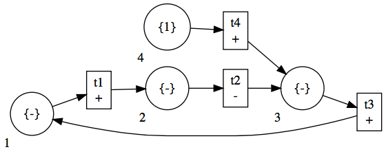

# Causal Loop Nets (CLN)

This is proof-of-concept prototype to work with Causal Loop Petri Nets, or just Causal Loop Nets (CLN).

The prototype includes: 
- a small scala DSL to specify CLN
- calculation of reachability graphs
- visualization of CLN and reachability graphs
- verification of some properties

A CLN is a formal representation for Causal Loop Diagrams, which allows to verify some properties over them. 
The theory behind CLN is to appear in a paper published in [CSD&M Asia'18](http://www.2018.csdm-asia.net).

## Using the prototype

To compile and run the prototype you can use [```sbt```](http://www.scala-sbt.org) (build tool for Scala) by executing the command ```sbt console``` in the terminal under the project folder (clpn/). 

After executing ```sbt console``` you can import the necessary classes listed below, and 
try some examples as follows.


```scala 
import clpn._
import clpn.backend.Dot
import clpn.DSL._
import clpn.analysis.ReachabilityGraph._
import clpn.analysis.Verification._

// A CLN corresponding to the temperature CLD example below 
// Initial marking set to an increase in variable 4 (desired temperature)
var tmp = newclpn ++ (
  1 -->+ 2 by "t1",
  2 -->- 3 by "t2",
  3 -->+ 1 by "t3",
  4 -->+ 3 by "t4"
) initMark((4, Set(1)))

// A similar CLN for the temperature example 
// assuming an initial marking in two different variables, and 
// a delay of 3 time units in transition t1
var tmpDelay = newclpn ++ (
  1 -->+ 2 by "t1" in 3,
  2 -->- 3 by "t2",
  3 -->+ 1 by "t3",
  4 -->+ 3 by "t4"
) initMark((4, Set(1)),(2,Set(-1)))

```
For example, the CLN `tmp` corresponds to the CLD below, 
with the following mapping between variable numbers and names: `1 -> Temperature Setting; 2 -> Actual temperature; 3 -> Gap; 4 -> Desired Temperature`.


We can obtain the _reachability graph_ associated to a CLN by using the following command.
 
 ```scala
 /// The behavior of a CLN, i.e., its reachability graph 
 val reachGraph = tmp.behavior
 ```

## Visualizing CLN and reachability graphs 
 
 It is possible to translate a CLN and a reachability graph into a graph described in the ```dot``` language. This way it is easy to visualize and debug CLN. 
 
 
 
 
 ```scala
 toDot(tmp)
 //outputs the CLN in dot format
 
 reach2dot(tmp.behavior)
 //outputs the reachability graph obtained from the CLN in dot format
 
 reach2dot(tmp.behavior,Set(2))
 //outputs the reachability graph obtained from the CLN in dot format but showing only information associated to variable 2
``` 

For example the first command outputs the following dot description:


To visualize the resulting dot graph description, we can use an online tool for graphviz (http://viz-js.com) or through the command line if `dot` is installed in the system, and 
obtained the following figures.

| CLN  | Reachability Gragph |
|:----:|:-------------------:|
|  |  |
 

## Verifying properties

Currently the prototype can help to verify properties regarding the behavior of a given variable `v`. In particular, 
we can verify if `v` eventually exhibits an expected behavior. 
 
We can ask this using two different methods, `exists` and `relaxedExists`. In both cases the methods take a reachability graph, a variable, and a list of _tokens_, which represents the _property_
or expected behavior. 

In the `exists` method, the lists of token is interpreted as it is, and can have any number of consecutive _increas_, _decreas_, or _no change_ tokens. 
The methods searches for a trace of states in the reachability graph such that the given variable behaves exactly as in the list of tokens.

In the `relaxedExists` method, the list consists only of _increase_ and _decrease_ tokens, and it cannot have consecutive tokens of the same type. 
The method searches for a trace of states in the reachability graph that satisfies the expected behavior using the simulation relation ~<sub>1</sub>.

We illustrate their use with some examples over the temperature CLN:

```scala
exists(tmp.behavior,1,List(Inc,NC,NC,Dec))
// returns = Trace(List(2, 3, 4, 5))

exists(tmp.behavior,1,List(Inc,Inc))
// returns = Trace(List()) 
// an empty trace means the property is not satisfied

relaxedExists(tmp.behavior,3,List(Inc,Dec))
// returns = Trace(List(1, 2, 3, 4))
```
Notice that `List(Inc,Dec)` is a _summary function_ for `List(Inc,NC,NC,Dec)` using the simulation relation ~<sub>1</sub>. 

In the `relaxedExists` method example it doesn't matter if after the first increase there were more increases or no change, the method abstract of these using the simulation relation ~<sub>1</sub>.
 
We can visualize the trace in a graph by using the following command and obtain the figure below. 

```scala
// Example 1
val traceExists = exists(tmp.behavior,1,List(Inc,NC,NC,Dec))

//Example 2
val traceRelaxed = relaxedExists(tmp.behavior,3,List(Inc,Dec))

// convert to dot the reachability graph and highlights the states in the trace
trace2dot(tmp.behavior,traceExists)
trace2dot(tmp.behavior,traceRelaxed)
```
|  Example 1 (`exists`) | Example 2 (`relaxedExists`)|
|:----:|:-------------------:|
|||